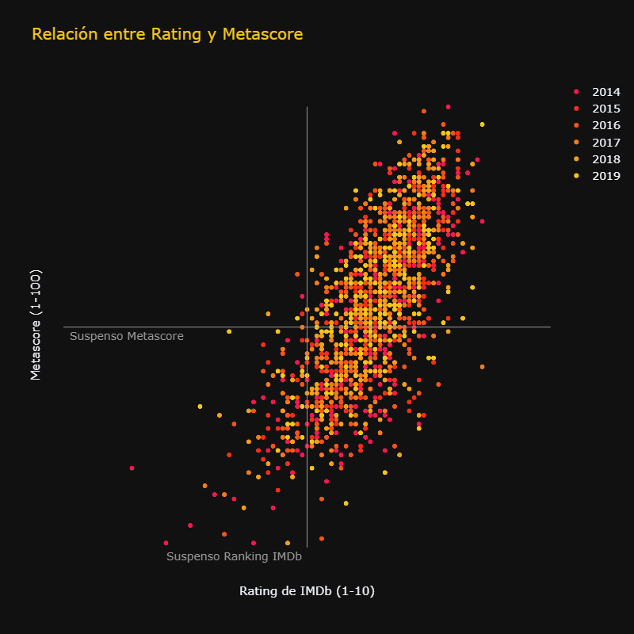
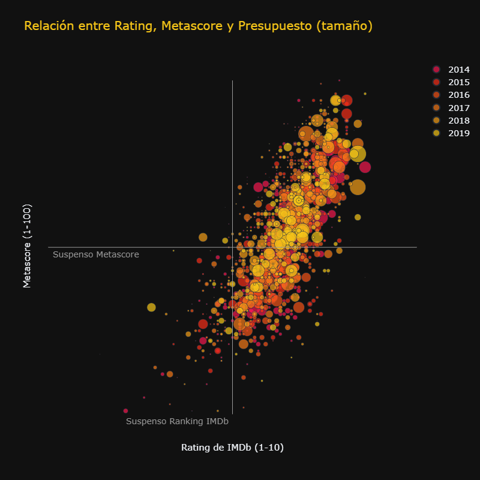
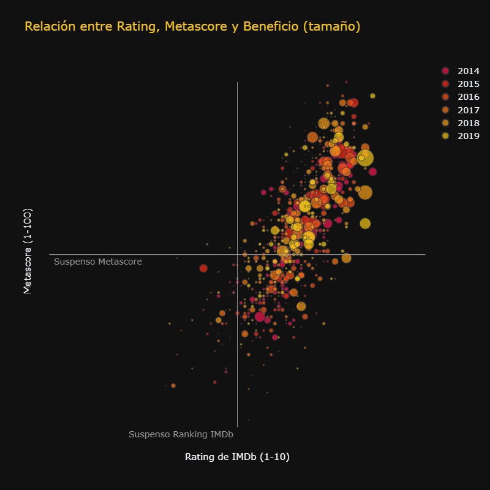
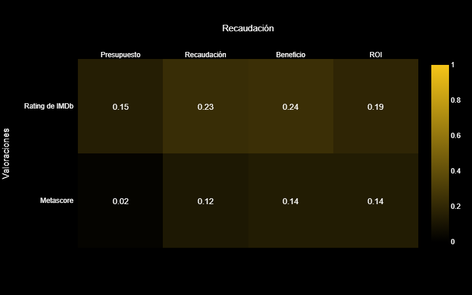
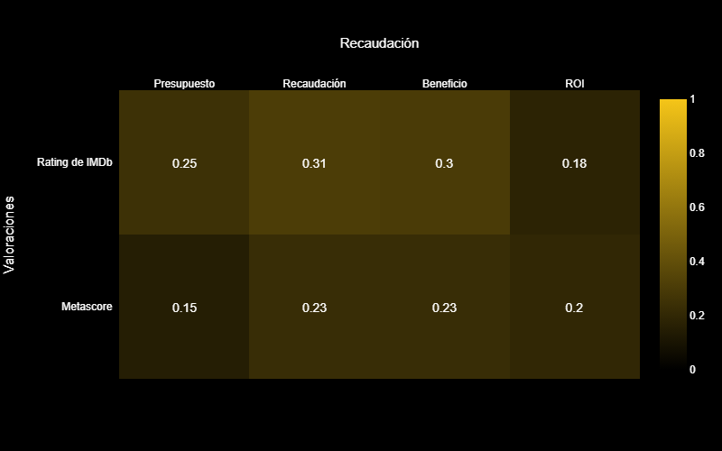
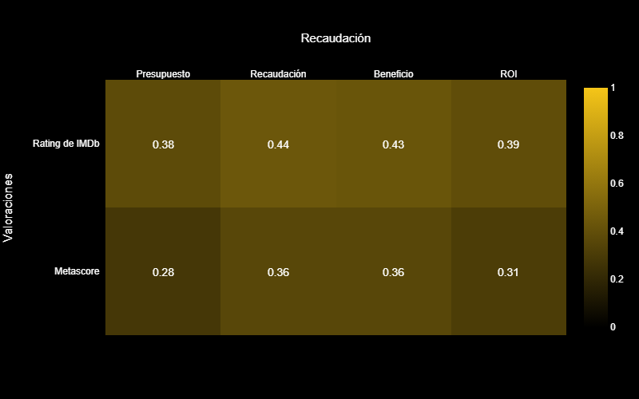

# Público, crítica y taquilla en IMDb
### Análisis exploratorio de datos | Películas 2014 a 2019
Con la intención de analizar un dataset representativo de todo tipo de películas he acudido al portal IMDb, el más completo a nivel internacional. Y he extraído los datos por dos vías: 

##### 1. Tablas relacionales descargadas de IMBd
IMDb ofrece, de manera gratuita, una serie de archivos `.csv` que se corresponden con parte la información de su base de datos. De estas tablas he conseguido información como identificador de IMDb, título en español y en su versión original, duración, géneros, rating IMDb, año.

##### 2. *Web scrapping* portal IMBd
Como los archivos proporcionados por IMDb no contienen información económica de las películas he recogido esta información del propio portal IMDb mediante *web scrapping*. También era importante el dato de valoración de la crítica, el Metascore que sin ser un dato propio de IMBd sí que se puede visualizar en el portal. Además he recogido información que podría ser relevante más adelante como directores, guionistas, actores y países. Debido a la ingente cantidad de información, he tenido que utilizar parallel para recoger información simultáneamente de varias páginas simultáneamente, una página por núcleo del procesador de mi portátil. La herramienta principal en esta estapa fue Selenium.
> **117.482 páginas escrapeadas** (todas las películas de 2014 a 2020)

##### 3. *Data mining* y *merge* de las tablas
El siguiente paso fue limpiar las tablas ya que había muchos registros *fake*, tanto en las tablas descargadas de IMDb como en el portal.
En esta fase fue necesario convertir la información escrapeada del portal ya que todo era texto. En el caso del presupuesto y la recaudación también fue necesario separar la información de la moneda y la cantidad. La moneda tuvo que ser trasladada al código ISO correspondiente para poder aisgnarle la tasa de cambio correspondiente a la moneda y el año. Finalmente normalicé los valores en dólares para todas las películas.
Finalmente, teniendo la información de presupuesto y recaudación, he generado dos nuevos datos que son los beneficios y el retorno de la inversión o ROI.

##### 4. Exploración
En esta etapa hice un análisis univariante, bivariante y multivariante de los datos de valoraciones y recaudación.

##### 5. Conclusiones
En el análisis podemos concluir que las valoraciones de los usuarios tienen una mayor tendencia a aprobar las películas, sin embargo las puntuaciones de la crítica son más dispersas e incluso llegan a otorgar la puntuación máxima de 100.

Rating de IMDb y Metascore                                                   |
:---------------------------------------------------------------------------:|
   |

Si relacionamos las valoraciones con la información económica de las películas podemos observar que no guarda gran relación con el presupuesto, pues encontramos películas de alto presupuesto suspensas en las calificaciones. Sin embargo si relacionamos las valoraciones con el beneficio observamos que una tendencia de mayor puntuaciones a mayor beneficio. La variable beneficio conlleva implícitamente dos conceptos: éxito en taquilla y alto presupuesto. Este tipo de película tiende a ser bien valorado por los usuarios de IMDb.

Valoraciones y Presupuesto                                      |  Valoraciones y Beneficio
:--------------------------------------------------------------:|:--------------------------------------------------------------:
  |  

Si bien la correlación entre las valoraciones y los datos económicos de las películas es débil. Pero sí es cierto que la tendencia es más fuerte para el rating de usuarios que para la valoración de los críticos (Metascore).

Correlaciones entre las valoraciones y los datos económicos |
:----------------------------------------------------------:|
   |

Ciertos subgrupos de la muestra de película tienen una mayor correlación, como los géneros del tipo de acción, thriller y horror, y a nivel de países también mejora la correlación cuando nos centramos en EEUU (país de origen del portal IMDb).

Correlaciones entre las valoraciones y los datos económicos para películas de EEUU | Correlaciones entre las valoraciones y los datos económicos para películas del género de acción |
:---------------------------------------------------------------------------------:|:----------------------------------------------------------------------------------------------:|
              |                         |

 

---
## Herramientas utilizadas

| Web scrapping 		| Data mining		| Visualización  	|
|---					|---				|---				|
| - Visual Studio Code	| - Jupyter Lab		| - Streamlit		|
| - Python				| - Python			| - Python			|
| - Pandas				| - Regex			| - Regex			|
| - Selenium			| - Pandas			| - Pandas			|
| - Joblib / Parallel	| - Numpy			| - Numpy			|
| - Logging				|   				| - Matplotlib		|
| - Pickle				|   				| - Plotly			|
|   					|   				| - Google Slides	|

 

---
## Fuentes

IMDd Datasets
https://www.imdb.com/interfaces/

IMDb. Documentación para los datasets:
https://www.imdb.com/interfaces/

OECD. Tasas de cambio principales monedas por año:
https://data.oecd.org/conversion/exchange-rates.htm

Exchange Rates.Tasas de cambio otras monedas por año:
https://www.exchangerates.org.uk/

Google Developers. Listado de coordenadas de países:
https://developers.google.com/public-data/docs/canonical/countries_csv

Posible map for countries after clean and merge dataframes of years:
https://towardsdatascience.com/using-python-to-create-a-world-map-from-a-list-of-country-names-cd7480d03b10

